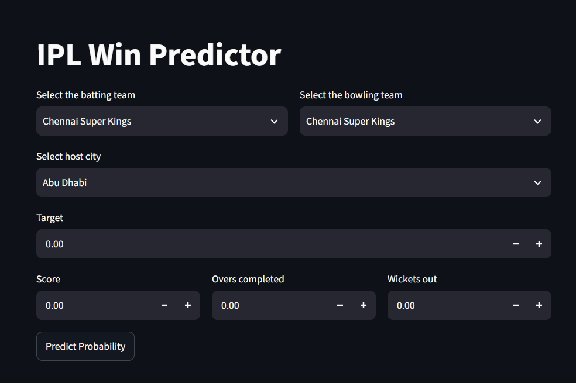
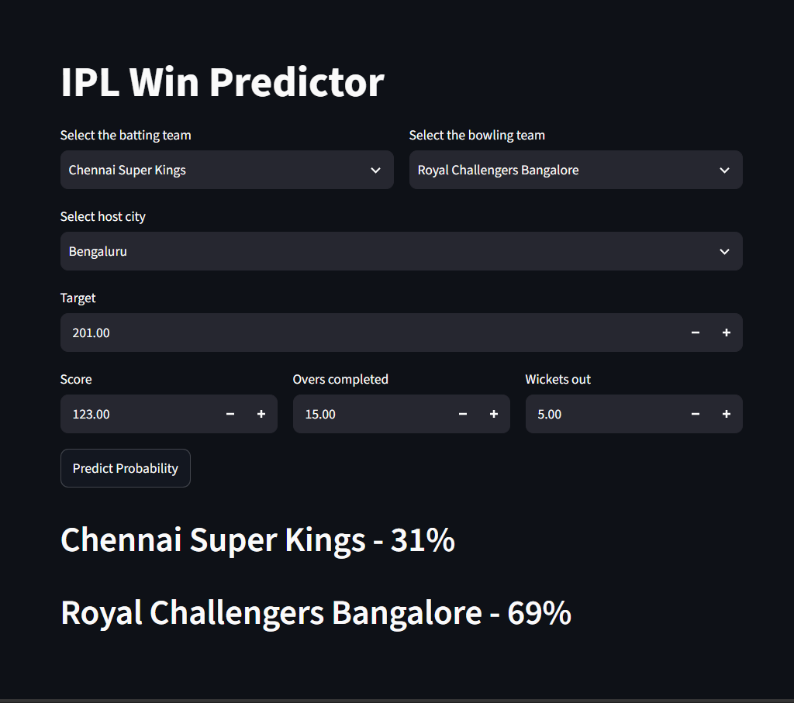

# 🏏 IPL Win Probability Predictor
> A Machine Learning-powered web application that predicts the winning probability of an IPL team during the second innings using real-time match conditions. Built with **Python, Scikit-learn, and Streamlit**, the application provides instant win probability predictions based on historical IPL data.
---
## 🌐 Live Demo
🚀 **Try the App Here:**  
**https://ipl-win-predictor-gwbyrbqernokduxlkqqr9h.streamlit.app/**
---
## 📌 Project Overview
The **IPL Win Probability Predictor** is an end-to-end Machine Learning project that estimates the winning chances of the batting team during the second innings of an IPL match. The prediction is based on key match parameters such as the target score, current score, overs completed, wickets remaining, batting team, bowling team, and host city.
The project combines historical IPL match data, feature engineering, machine learning, and an interactive Streamlit interface to deliver real-time probability predictions.
---
## 🎯 Objectives
- Predict the winning probability of IPL teams during run chases.
- Apply Machine Learning techniques to sports analytics.
- Build an interactive web application using Streamlit.
- Demonstrate feature engineering using cricket match statistics.
- Showcase an end-to-end Machine Learning deployment project.
---
## ✨ Features
- 🏏 Select Batting Team and Bowling Team
- 🌍 Choose Match Venue (Host City)
- 🎯 Enter Target Score
- 📊 Input Current Score, Overs Completed, and Wickets Lost
- ⚡ Real-time Win Probability Prediction
- 🤖 Scikit-learn Machine Learning Pipeline
- 💻 Interactive Streamlit User Interface
---
## 🛠️ Technologies Used
| Category | Technology |
|-----------|------------|
| Programming Language | Python |
| Machine Learning | Scikit-learn |
| Data Analysis | Pandas, NumPy |
| Web Framework | Streamlit |
| Model Serialization | Pickle |
| Notebook | Jupyter Notebook |
| Version Control | Git & GitHub |
---
## 📂 Dataset Information
The project utilizes historical IPL datasets containing detailed match and ball-by-ball information.
### Dataset Files
- `matches.csv`
- `deliveries.csv`
### Important Features Used
- Batting Team
- Bowling Team
- Host City
- Target Score
- Current Score
- Runs Left
- Balls Left
- Wickets Remaining
- Current Run Rate (CRR)
- Required Run Rate (RRR)
---
## ⚙️ Project Workflow
```text
Historical IPL Data
        │
        ▼
Data Collection
        │
        ▼
Data Cleaning
        │
        ▼
Feature Engineering
        │
        ▼
Model Training
        │
        ▼
Pipeline Serialization (pipe.pkl)
        │
        ▼
Streamlit Web Application
        │
        ▼
Real-Time Win Probability Prediction
```
---
## 🧠 Machine Learning Process
### 1. Data Collection
Historical IPL match data was collected for model training.
### 2. Data Preprocessing
- Cleaned missing values
- Filtered relevant matches
- Prepared second innings data
### 3. Feature Engineering
Created meaningful predictive features including:
- Runs Left
- Balls Left
- Wickets Remaining
- Current Run Rate
- Required Run Rate
- Match Venue
- Teams
### 4. Model Training
A Scikit-learn classification pipeline was trained using engineered features and serialized using Pickle (`pipe.pkl`).
### 5. Model Deployment
The trained model was deployed using Streamlit, allowing users to interact with the prediction system through a web interface.
---
## 📈 Model Performance
The trained classification model predicts the probability of:
- ✅ Batting Team Winning
- ✅ Bowling Team Winning
### Example Prediction
| Team | Winning Probability |
|------|----------------------|
| Mumbai Indians | 72% |
| Chennai Super Kings | 28% |
> **Note:** Evaluation metrics (Accuracy, Precision, Recall, F1-score, ROC-AUC) are not included because they were not available in the provided project files.
## 🖼️ Application Preview
---
### Home Page

---
### Prediction Result

---
## 📁 Project Structure
```text
ipl-win-probability-predictor/
│
├── app.py
├── pipe.pkl
├── requirements.txt
├── README.md
├── LICENSE
├── .gitignore
│
├── notebooks/
│   └── IPL_Win_Probability_Predictor.ipynb
│
├── data/
│   ├── matches.csv
│   └── deliveries.csv
│
├── images/
│   ├── app-preview.png
│   ├── prediction-result.png
│
```
---
## 🚀 Installation
### Clone the Repository
```bash
git clone https://github.com/onlypradeep-05/ipl-win-probability-predictor.git
```
### Navigate to the Project Folder
```bash
cd ipl-win-probability-predictor
```
### Install Dependencies
```bash
pip install -r requirements.txt
```
### Run the Application
```bash
streamlit run app.py
```
---
## 🔮 Future Improvements
- Improve model accuracy using advanced ensemble algorithms.
- Support the latest IPL franchise names.
- Integrate live cricket APIs for real-time predictions.
- Add probability trend visualization during matches.
- Enhance the user interface with richer analytics and charts.
- Deploy using Docker for easier portability.
---
## 💼 Skills Demonstrated
- Machine Learning
- Classification
- Feature Engineering
- Data Preprocessing
- Sports Analytics
- Model Deployment
- Streamlit
- Scikit-learn
- Python
- Pandas
- NumPy
- Git & GitHub
---
## 👨‍💻 Author
**Pradeep**
Aspiring Data Analyst | Machine Learning Enthusiast | Power BI Developer
### Connect with Me
- 💼 LinkedIn: https://www.linkedin.com/in/pradeep-chaudhary-714555328/
- 💻 GitHub: https://github.com/onlypradeep-05
---
## ⭐ Support
If you found this project useful, consider giving it a **⭐ Star** on GitHub. It helps increase the project's visibility and motivates further development.
---
## 📄 License
This project is licensed under the **MIT License**.
---
### 🙏 Acknowledgements
- IPL historical match datasets
- Streamlit
- Scikit-learn
- Pandas
- NumPy
- Python Open Source Community
